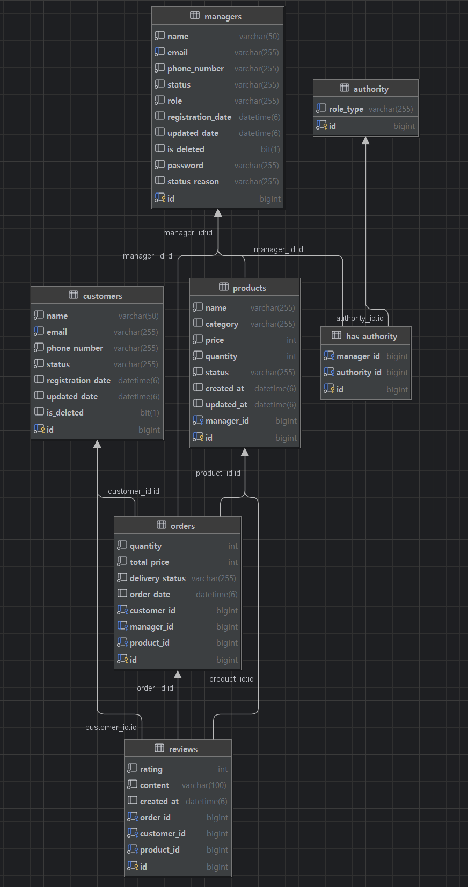

# 📝 Commerce Backoffice

이 프로젝트는 커머스 운영을 위한 백오피스 API 서버입니다.  
관리자 인증/권한 기반으로 고객, 상품, 주문, 리뷰를 관리하고 대시보드 데이터를 조회할 수 있도록 구성되어 있습니다.

## 📌 프로젝트 소개

- **프로젝트명**: Commerce-Backoffice
- **목표**: 운영 관리자가 핵심 도메인(고객/상품/주문/리뷰)을 효율적으로 관리할 수 있는 백오피스 API 제공
- **핵심 기능**
    - 관리자 회원가입/로그인/로그아웃(JWT)
    - 마이페이지(프로필 조회/수정, 비밀번호 변경)
    - 고객/상품/주문/리뷰 CRUD 및 상태 관리
    - 운영 현황 대시보드 조회

## 🛠️ 기술 스택

- **Language**: Java 21
- **Framework**: Spring Boot 4.0.5
- **Build Tool**: Gradle
- **Database**: MySQL
- **ORM**: Spring Data JPA (Hibernate)
- **Security**: Spring Security, JWT
- **Validation**: Jakarta Validation

## 👥 팀원 소개

| 이름  | 역할  | 담당 기능                           | GitHub                                    |
|-----|-----|---------------------------------|-------------------------------------------|
| 양한별 | 팀장  | JWT, Spring Security, RBAC, 관리자 | [(링크)](https://github.com/Astro-Luminoso) |
| 양성훈 | 부팀장 | 고객, 주문                          | [(링크)](https://github.com/tjdgns0618)     |
| 고수경 | 팀원  | 세션 인증, 공통 기능, 마이페이지, 대시보드       | [(링크)](https://github.com/kolyn092)       |
| 박진영 | 팀원  | 상품, 주문, 리뷰                      | [(링크)](https://github.com/jinyp01)        |

## 🚀 개발 환경 설정

### 사전 준비

- JDK 21
- MySQL 8.x
- Gradle Wrapper (`gradlew`, `gradlew.bat`)

### 환경 변수

`src/main/resources/application.properties` 기준으로 다음 환경 변수를 사용합니다.

```bash
DB_HOST=localhost
DB_PORT=3306
DB_NAME=db_name
DB_USER=db_user
DB_PASSWORD=change_me
DDL_AUTO=none
SQL_INIT=always
STRENGTH=12
JWT_SECRET=your-secret-key
JWT_EXPIRE_TIME=86400000
```

### 로컬 실행

```bash
# Windows
gradlew.bat bootRun

# macOS / Linux
./gradlew bootRun
```

- 기본 컨텍스트 패스: `/api/v1`
- 예시: `http://localhost:8080/api/v1`

### 초기 데이터

- `src/main/resources/data.sql` 실행 시 테이블 생성 및 기본 권한/관리자 데이터가 초기화됩니다.
- 기본 관리자 계정(샘플)
    - email: `admin@example.com`
    - password: (bcrypt 해시로 저장되어 있음)

## 🏗️ 프로젝트 구조

```text
src/main/java/dev/nbcsparta/assignment/commerce_backoffice
├─ config         # 보안, JWT, 인증/인가 설정
├─ controller     # API 엔드포인트
├─ service        # 비즈니스 로직
├─ repository     # 데이터 접근 계층
├─ entity         # JPA 엔티티
├─ dto            # 요청/응답 DTO
├─ enumerate      # 도메인 enum
└─ exception      # 예외/전역 핸들러
```

## 📏 팀 컨벤션

- **브랜치 전략**
  - Git Flow 전략을 따름
  - main → dev → `feat/**` 순으로 브랜치 생성
    - `feat/**` : 기능 구현
    - `refactor/**` : 리펙토링
    - `docs/**` : 문서 - 주석만 추가하는 목적의 경우 포함
    - `hotfix/**` : dev 혹은  main 브렌치 내에서 버그 발견시 버그 수정에 사용
    - `chore/**` : 프로젝트 설정 변경 dependencies, gradle config
    - `test/**` : 테스트 Unit, Integration 등등
- **커밋 메시지**
    - `feat:`, `refactor:`, `chore:`, `fix:`, `test:`, `merge:`, `docs:`
- **코드 구조**
    - `Controller -> Service -> Repository` 계층 분리
    - 메서드 네이밍 - 앞에 행위에 대한 동사 붙이기
    - Boolean 변수명 앞에 is 붙이기
    - DTO record 가능하면 사용
    - Optional 사용할 수 있으면 적용
    - 리턴은 한 줄 개행
    - 어노테이션 매개변수는 하나마다 개행
- **응답 포맷**
    - `CommonResponse<T>` 형태로 일관된 응답 래핑 사용
- **예외 처리**
    - 커스텀 예외 + `GlobalExceptionHandler`로 공통 처리

## 🗄️ ERD


## 📡 API 명세서

기본 URL: `/api/v1`

### 인증/인가

| Method | Endpoint | 설명 |
| --- | --- | --- |
| POST | `/register` | 관리자 회원가입 |
| POST | `/login` | 로그인(JWT 발급) |
| POST | `/logout` | 로그아웃 |

### 마이페이지

| Method | Endpoint | 설명 |
| --- | --- | --- |
| GET | `/mypages` | 내 프로필 조회 |
| PUT | `/mypages` | 내 프로필 수정 |
| PATCH | `/mypages` | 내 비밀번호 변경 |

### 관리자

| Method | Endpoint | 설명 |
| --- | --- | --- |
| GET | `/managers` | 관리자 목록 조회(필터/페이징) |
| GET | `/managers/{id}` | 관리자 상세 조회 |
| PATCH | `/managers/{managerId}/status` | 관리자 상태 변경 |
| PATCH | `/managers/{managerId}/role` | 관리자 권한 변경 |
| PUT | `/managers/{managerId}` | 관리자 정보 수정 |
| DELETE | `/managers/{managerId}` | 관리자 삭제 |

### 고객

| Method | Endpoint | 설명 |
| --- | --- | --- |
| POST | `/customers` | 고객 생성 |
| GET | `/customers` | 고객 목록 조회(필터/페이징) |
| GET | `/customers/{customerId}` | 고객 상세 조회 |
| PUT | `/customers/{customerId}` | 고객 정보 수정 |
| PATCH | `/customers/{customerId}` | 고객 상태 변경 |
| DELETE | `/customers/{customerId}` | 고객 삭제 |

### 상품

| Method | Endpoint | 설명 |
| --- | --- | --- |
| POST | `/products` | 상품 등록 |
| GET | `/products` | 상품 목록 조회(필터/페이징) |
| GET | `/products/{productId}` | 상품 상세 조회 |
| PUT | `/products/{productId}` | 상품 정보 수정 |
| PATCH | `/products/{productId}/status` | 상품 상태 변경 |
| DELETE | `/products/{productId}` | 상품 삭제 |

### 주문

| Method | Endpoint | 설명 |
| --- | --- | --- |
| POST | `/orders` | 주문 생성 |
| GET | `/orders` | 주문 목록 조회(필터/페이징) |
| GET | `/orders/{orderId}` | 주문 상세 조회 |
| PATCH | `/orders/{orderId}` | 주문 상태 변경 |
| DELETE | `/orders/{orderId}` | 주문 삭제 |

### 리뷰

| Method | Endpoint | 설명 |
| --- | --- | --- |
| GET | `/reviews` | 리뷰 목록 조회(필터/페이징) |
| GET | `/reviews/{reviewId}` | 리뷰 상세 조회 |
| DELETE | `/reviews/{reviewId}` | 리뷰 삭제 |
